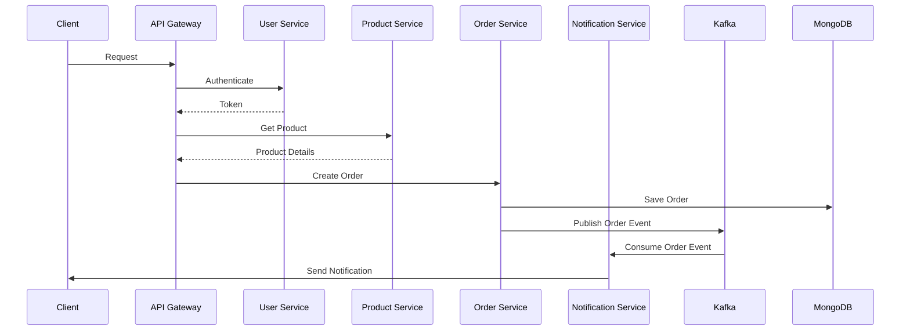
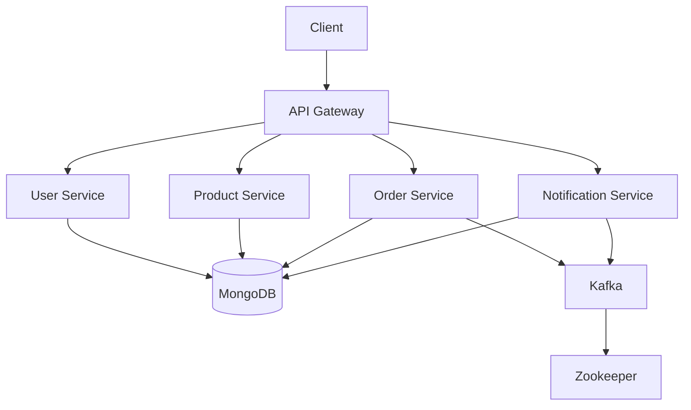
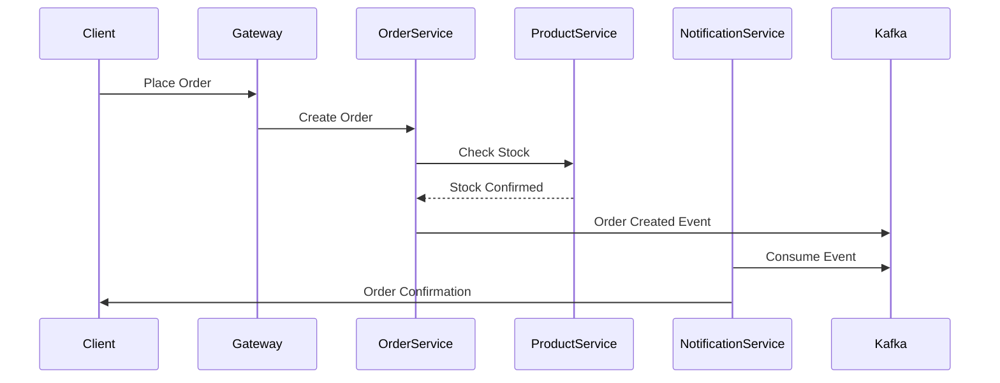
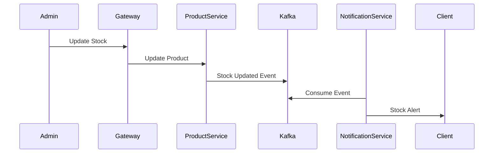

# E-Commerce Microservices Application

## Prerequisites

### Required Software Versions
- Node.js >= 14.x
- npm >= 6.x
- Docker >= 20.10.x
- Kubernetes >= 1.19.x
- Minikube >= 1.25.x
- Git >= 2.x
- MongoDB >= 4.4.x
- Apache Kafka >= 3.6.x
- Redis >= 6.2.x
- Apache Zookeeper >= 3.7.x

### Framework Versions
- Express.js >= 4.17.x
- React.js >= 17.0.x
- Material-UI >= 4.11.x
- Socket.IO >= 4.8.x
- JWT >= 8.5.x

### System Requirements
- Minimum 8GB RAM
- 4 CPU cores
- 20GB free disk space

## Technologies Stack

### Backend
- **Node.js** - Runtime environment
- **Express.js** - Web framework
- **MongoDB** - Primary database
- **Kafka** - Message broker for event-driven architecture
- **Redis** - Caching layer
- **JWT** - Authentication and authorization
- **Socket.IO** - Real-time notifications

### Frontend
- **React.js** - UI library
- **Redux** - State management
- **Material-UI** - Component library
- **Axios** - HTTP client

### DevOps & Infrastructure
- **Docker** - Containerization
- **Kubernetes** - Container orchestration
- **Nginx** - API Gateway & reverse proxy
- **Jenkins** - CI/CD pipeline
- **ELK Stack** - Logging (Elasticsearch, Logstash, Kibana)
- **Prometheus & Grafana** - Monitoring

## Project Structure
```
ecommerce-app/
├── api-gateway/                 # API Gateway service
│   ├── src/
│   ├── Dockerfile
│   └── package.json
│
├── backend/
│   ├── user-service/           # User management service
│   │   ├── src/
│   │   ├── tests/
│   │   ├── Dockerfile
│   │   └── package.json
│   │
│   ├── product-service/        # Product management service
│   │   ├── src/
│   │   ├── tests/
│   │   ├── Dockerfile
│   │   └── package.json
│   │
│   ├── order-service/          # Order management service
│   │   ├── src/
│   │   ├── tests/
│   │   ├── Dockerfile
│   │   └── package.json
│   │
│   └── notification-service/    # Notification handling service
│       ├── src/
│       ├── tests/
│       ├── Dockerfile
│       └── package.json
│
├── frontend/                    # React frontend application
│   ├── public/
│   ├── src/
│   ├── Dockerfile
│   └── package.json
│
├── shared-lib/                  # Shared utilities and models
│   ├── src/
│   └── package.json
│
├── k8s/                        # Kubernetes manifests
│   ├── api-gateway.yaml
│   ├── user-service.yaml
│   ├── product-service.yaml
│   ├── order-service.yaml
│   ├── notification-service.yaml
│   ├── mongodb.yaml
│   ├── kafka.yaml
│   ├── redis.yaml
│   └── configmap.yaml
│
├── scripts/                    # Deployment and utility scripts
│   ├── setup.ps1
│   ├── k8s-deploy.ps1
│   └── start-services.bat
│
├── docker-compose.yml          # Docker compose configuration
├── docker-compose.dev.yml      # Development docker compose
├── package.json
└── README.md
```

## Service Details

### API Gateway
- Route management
- Request validation
- Authentication & Authorization
- Rate limiting
- Load balancing

### User Service
- User management
- Authentication
- Profile management
- Role-based access control

### Product Service
- Product catalog management
- Inventory management
- Product search & filtering
- Category management

### Order Service
- Order processing
- Payment integration
- Order status management
- Shopping cart management

### Notification Service
- Email notifications
- Push notifications
- Real-time updates
- SMS integration

## Data Flow



## System Architecture


## Repository Setup

1. Clone the main repository:
```bash
git clone https://github.com/your-org/ecommerce-app.git
cd ecommerce-app
```

2. Initialize and update submodules:
```bash
# Initialize submodules
git submodule init

# Update submodules
git submodule update --init --recursive

# Pull latest changes for all submodules
git submodule update --remote --merge

# Check submodule status
git submodule status

# Add a new submodule
git submodule add -b main [repository-url] [path]

# Remove a submodule
git submodule deinit [path]
git rm [path]
```

## Deployment Options

### 1. Local Development (Without Containers)

1. Install dependencies and setup:
```bash
# Run the setup script
.\scripts\setup.ps1

# Or use npm command
npm run setup
```

2. Start all services:
```bash
# Using start-services.bat
.\start-services.bat
```

Key points for start-services.bat:
- Ensures Zookeeper and Kafka are running first
- Opens separate terminal windows for each service
- Links shared library automatically
- Builds and starts frontend application

### 2. Docker Compose Deployment

Key commands:
```bash
# Build and start all services
docker-compose up --build -d

# View logs
docker-compose logs -f

# View logs for specific service
docker-compose logs -f [service-name]

# Stop all services
docker-compose down

# Stop and remove volumes
docker-compose down -v

# Check service status
docker-compose ps

# Restart specific service
docker-compose restart [service-name]
```

### 3. Kubernetes Deployment

1. Check cluster status:
```bash
# View all pods in ecommerce namespace
kubectl get pods -n ecommerce

# View all services
kubectl get svc -n ecommerce

# View all deployments
kubectl get deployments -n ecommerce
```

2. Pod management:
```bash
# Get pod logs
kubectl logs [pod-name] -n ecommerce

# Get pod details
kubectl describe pod [pod-name] -n ecommerce

# Execute command in pod
kubectl exec -it [pod-name] -n ecommerce -- /bin/sh

# Delete pod (will recreate)
kubectl delete pod [pod-name] -n ecommerce
```

3. Deployment commands:
```bash
# Deploy all services
kubectl apply -f k8s/

# Deploy specific service
kubectl apply -f k8s/[service-name].yaml

# Scale deployment
kubectl scale deployment [deployment-name] --replicas=3 -n ecommerce

# Rollout restart
kubectl rollout restart deployment [deployment-name] -n ecommerce
```

4. Debugging:
```bash
# Check pod events
kubectl get events -n ecommerce --sort-by='.lastTimestamp'

# Check init container logs
kubectl logs [pod-name] -c [init-container-name] -n ecommerce

# Port forward service
kubectl port-forward service/[service-name] [local-port]:[service-port] -n ecommerce
```

## Service URLs

Local/Docker:
- Frontend: http://localhost:3000
- API Gateway: http://localhost:8080
- User Service: http://localhost:3001
- Order Service: http://localhost:3002
- Notification Service: http://localhost:3003
- Product Service: http://localhost:3004

Kubernetes:
```bash
# Get API Gateway URL
minikube service api-gateway -n ecommerce --url
```

## Troubleshooting

### Docker Issues
```bash
# Reset Docker environment
docker system prune -af --volumes
docker-compose down -v
docker-compose up --build -d
```

### Kubernetes Issues
```bash
# Reset Minikube
minikube delete
minikube start
kubectl apply -f k8s/

# Check service connectivity
kubectl run -it --rm debug --image=busybox -n ecommerce -- sh
# Then use wget or nc to test services
```

### Submodule Issues
```bash
# Reset submodules
git submodule deinit -f .
git submodule update --init --recursive
```

## Environment Variables
Key environment variables are stored in:
- `.env` for local development
- `docker-compose.yml` for Docker deployment
- `k8s/configmap.yaml` for Kubernetes deployment

## Additional Resources
- API Documentation: [link]
- Architecture Documentation: [link]

## API Documentation

### API Gateway (Port: 8080)
Base URL: `/api/v1`

#### Authentication Endpoints
```http
POST /auth/login
POST /auth/register
POST /auth/refresh-token
GET  /auth/verify-email/:token
POST /auth/forgot-password
POST /auth/reset-password
```

#### User Service (Port: 3001)
```http
GET    /users                 # List users (Admin only)
GET    /users/:id            # Get user details
PUT    /users/:id            # Update user
DELETE /users/:id            # Delete user
GET    /users/profile        # Get own profile
PUT    /users/profile        # Update own profile
POST   /users/avatar         # Upload avatar
GET    /users/:id/addresses  # Get user addresses
POST   /users/addresses      # Add address
PUT    /users/addresses/:id  # Update address
DELETE /users/addresses/:id  # Delete address
```

#### Product Service (Port: 3004)
```http
GET    /products                    # List products
GET    /products/:id               # Get product details
POST   /products                   # Create product (Admin)
PUT    /products/:id               # Update product (Admin)
DELETE /products/:id               # Delete product (Admin)
GET    /products/categories        # List categories
POST   /products/categories        # Create category (Admin)
PUT    /products/categories/:id    # Update category (Admin)
DELETE /products/categories/:id    # Delete category (Admin)
POST   /products/:id/reviews       # Add product review
GET    /products/:id/reviews       # Get product reviews
DELETE /products/reviews/:id       # Delete review (Admin/Owner)
```

#### Order Service (Port: 3002)
```http
GET    /orders                # List orders
GET    /orders/:id           # Get order details
POST   /orders               # Create order
PUT    /orders/:id/status    # Update order status
DELETE /orders/:id           # Cancel order
GET    /orders/cart          # Get cart
POST   /orders/cart          # Add to cart
PUT    /orders/cart/:id      # Update cart item
DELETE /orders/cart/:id      # Remove from cart
POST   /orders/checkout      # Checkout process
GET    /orders/history       # Order history
```

#### Notification Service (Port: 3003)
```http
WebSocket: /socket.io        # Real-time notifications
GET    /notifications        # List notifications
PUT    /notifications/:id    # Mark as read
DELETE /notifications/:id    # Delete notification
POST   /notifications/subscribe    # Subscribe to notifications
POST   /notifications/unsubscribe  # Unsubscribe from notifications
```

### API Request/Response Examples

#### User Authentication
```json
// POST /api/v1/auth/login
Request:
{
  "email": "user@example.com",
  "password": "password123"
}

Response:
{
  "token": "jwt.token.here",
  "refreshToken": "refresh.token.here",
  "user": {
    "id": "user_id",
    "email": "user@example.com",
    "name": "John Doe",
    "role": "user"
  }
}
```

#### Product Creation
```json
// POST /api/v1/products
Request:
{
  "name": "Product Name",
  "description": "Product description",
  "price": 99.99,
  "category": "category_id",
  "stock": 100,
  "images": ["image_url1", "image_url2"]
}

Response:
{
  "id": "product_id",
  "name": "Product Name",
  "description": "Product description",
  "price": 99.99,
  "category": {
    "id": "category_id",
    "name": "Category Name"
  },
  "stock": 100,
  "images": ["image_url1", "image_url2"],
  "createdAt": "2024-01-20T10:00:00Z"
}
```

## Architecture Documentation

### System Components

1. **API Gateway**
   - Rate limiting: 100 requests/minute
   - JWT validation
   - Request routing
   - Load balancing
   - Response caching
   - Error handling

2. **Service Communication**
   - Synchronous: REST APIs
   - Asynchronous: Kafka events
   - WebSocket: Real-time updates

3. **Data Storage**
   - MongoDB: Primary database
   - Redis: Caching layer
   - Kafka: Event store

### Event Flow Patterns

1. **Order Processing Flow**


2. **Inventory Update Flow**


### Security Architecture

1. **Authentication Flow**
   - JWT-based authentication
   - Token refresh mechanism
   - Role-based access control
   - API key validation for service-to-service communication

2. **Data Security**
   - Encryption at rest
   - TLS for data in transit
   - PII data encryption
   - Audit logging

### Scalability Design

1. **Horizontal Scaling**
   - Stateless services
   - Kubernetes auto-scaling
   - Load balancer configuration
   - Database sharding strategy

2. **Caching Strategy**
   - Redis cache layers
   - Cache invalidation patterns
   - Distributed caching
   - Cache warming

### Monitoring and Logging

1. **Metrics Collection**
   - Prometheus metrics
   - Grafana dashboards
   - Custom business metrics
   - SLA monitoring

2. **Logging Strategy**
   - Centralized logging (ELK Stack)
   - Log levels and retention
   - Error tracking
   - Performance monitoring

### Disaster Recovery

1. **Backup Strategy**
   - Daily automated backups
   - Point-in-time recovery
   - Cross-region replication
   - Backup validation

2. **Failover Process**
   - Service redundancy
   - Database failover
   - Circuit breaker patterns
   - Fallback mechanisms
   ```
